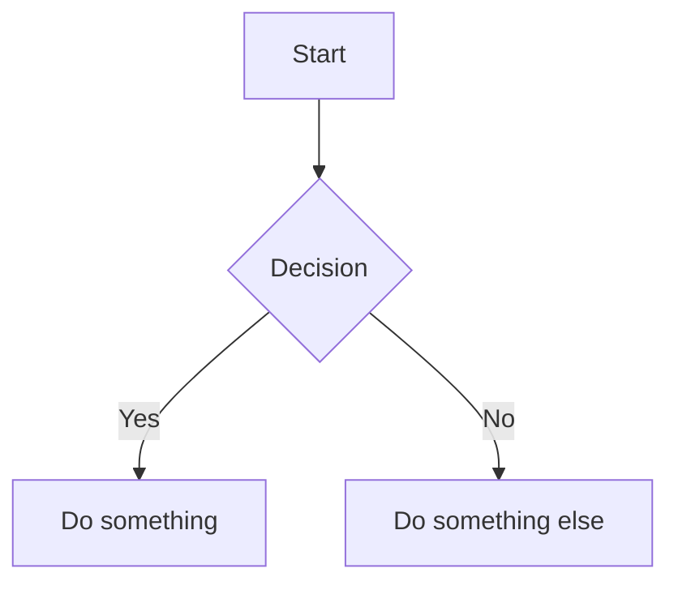

# Markdown Live Preview

A powerful, feature-rich markdown editor with live preview. Write markdown on the left, see the rendered output on the right - in real-time.

**[Try it live](https://markdownlivepreview.com/)**

## Features

### Editor
- **Monaco Editor** - VS Code's powerful editor with markdown syntax support
- **Line Numbers** - Toggle line numbers on/off
- **Word Count** - Real-time word, character, and line count
- **Auto-save** - Your content is automatically saved to local storage
- **Scroll Sync** - Synchronized scrolling between editor and preview

### Markdown Support
- **Syntax Highlighting** - Beautiful code highlighting powered by highlight.js
- **GFM Support** - GitHub Flavored Markdown including:
  - Task lists / Checkboxes
  - Tables
  - Strikethrough
  - Footnotes
- **Emoji Support** - Use `:emoji:` syntax (e.g., `:rocket:`, `:smile:`)
- **Table of Contents** - Auto-generate TOC with `[TOC]` or `[[toc]]`

### Advanced Features
- **Math/LaTeX** - Render equations with KaTeX (`$inline$` and `$$block$$`)
- **Mermaid Diagrams** - Create flowcharts, sequence diagrams, and more
- **Image Drag & Drop** - Drop images directly into the editor

### Export Options
- **Markdown (.md)** - Download the raw markdown file
- **HTML** - Standalone HTML with embedded styles
- **PDF** - Print-ready PDF via browser print dialog
- **DOC** - Microsoft Word compatible document

### UI/UX
- **Dark Mode** - Toggle between light and dark themes
- **Fullscreen Preview** - Expand preview to full width
- **Responsive Design** - Works on desktop, tablet, and mobile
- **PWA Support** - Install as an app, works offline

### Keyboard Shortcuts

| Shortcut | Action |
|----------|--------|
| `Ctrl/Cmd + Shift + E` | Export as HTML |
| `Ctrl/Cmd + D` | Toggle dark mode |
| `Ctrl/Cmd + O` | Import file |
| `F11` | Toggle fullscreen preview |
| `Escape` | Exit fullscreen |

## Getting Started

### Prerequisites
- Node.js 18+
- npm or yarn

### Installation

```bash
# Clone the repository
git clone https://github.com/tanabe/markdown-live-preview.git
cd markdown-live-preview

# Install dependencies
npm install
# or
make setup
```

### Development

```bash
# Start development server
npm run dev
# or
make dev
```

The app will be available at `http://localhost:3000`

### Build

```bash
# Create production build
npm run build
# or
make build
```

### Preview Production Build

```bash
npm run preview
# or
make preview
```

## Project Structure

```
markdown-live-preview/
├── src/
│   ├── main.js          # Main application logic
│   └── export.js        # Export functionality (HTML, PDF, DOC, MD)
├── public/
│   ├── css/
│   │   └── style.css    # Main styles with dark mode support
│   ├── image/           # Static images
│   ├── manifest.json    # PWA manifest
│   ├── sw.js           # Service worker for offline support
│   └── favicon.png
├── index.html           # Entry HTML
├── vite.config.js       # Vite configuration
├── package.json
└── README.md
```

## Tech Stack

- **Build Tool**: [Vite](https://vitejs.dev/)
- **Editor**: [Monaco Editor](https://microsoft.github.io/monaco-editor/)
- **Markdown Parser**: [Marked](https://marked.js.org/)
- **Syntax Highlighting**: [highlight.js](https://highlightjs.org/)
- **Math Rendering**: [KaTeX](https://katex.org/)
- **Diagrams**: [Mermaid](https://mermaid.js.org/)
- **Sanitization**: [DOMPurify](https://github.com/cure53/DOMPurify)
- **Styling**: [GitHub Markdown CSS](https://github.com/sindresorhus/github-markdown-css)

## Examples

### Math Equations

```markdown
Inline: $E = mc^2$

Block:
$$
\frac{-b \pm \sqrt{b^2 - 4ac}}{2a}
$$
```

### Mermaid Diagrams

````markdown

````

### Task Lists

```markdown
- [x] Completed task
- [ ] Incomplete task
```

### Footnotes

```markdown
Here's a sentence with a footnote[^1].

[^1]: This is the footnote content.
```

## Contributing

Contributions are welcome! Please feel free to submit a Pull Request.

1. Fork the repository
2. Create your feature branch (`git checkout -b feature/amazing-feature`)
3. Commit your changes (`git commit -m 'Add some amazing feature'`)
4. Push to the branch (`git push origin feature/amazing-feature`)
5. Open a Pull Request

### Development Guidelines

- Run `npm run lint` before committing
- Follow the existing code style
- Add tests for new features when applicable
- Update documentation as needed

## License

This project is licensed under the MIT License - see the [LICENSE](LICENSE) file for details.

## Acknowledgments

- Original project by [Hideaki Tanabe](https://github.com/tanabe)
- Monaco Editor by Microsoft
- All the amazing open-source libraries that make this possible

---

Made with love for the markdown community
